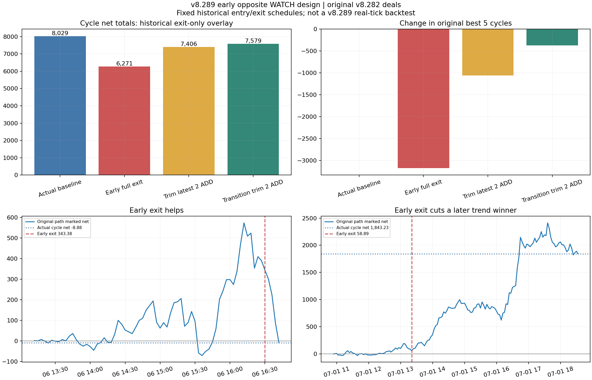

# v8.289 반대 사전신호 조기 수익보전 설계 분석

**결론: 기존 최초 진입·추가진입 신호를 유지하면서 반대 신호를 조기 경고로 승격하는 방향이 타당하다. 그러나 더 빨리 전부 청산하면 큰 추세 수익을 잘라 원본 수익이 감소했다.** 이번에는 v8.290의 새 최초 진입으로 교체하지 않았다. 기존 v8.289 WATCH/ACCEL/DIRECTION 흐름 위에 경고→ADD 보류→보호 강화→선별 감축을 설계하는 분석이다. EA 수정·배포는 하지 않았다.

## 자료와 버전의 구분

검토 소스는 업로드된 **v8.289 경량 버전**이다. 실제 결과 자료는 현재 읽을 수 있는 **v8.282 원본 CSV**다. v8.289 실제 전략테스터 결과가 없어 아래 수치를 v8.289 실제 성과로 주장하지 않는다. v8.284 CSV도 전송 한도로 읽지 못했다.

v8.282와 v8.289를 대조하면 `early_opposite_watch` 후보/edge 블록은 동일하다. `M3AutoEngine.mqh`의 차이는 재초기화 차트 continuation ACCEL 카운터 복원 1줄이었다. 따라서 원본의 early shadow를 v8.289 설계에 대한 과거 관찰 자료로 활용할 근거가 있다. 다만 v8.289의 TREND_REASSERTION tracker 시계/종료 처리는 바뀌었으므로 **v8.282의 reassertion label을 v8.289의 결과처럼 재사용하지 않았다.**

기간은 서버시간 2026-07-01~2026-08-13, GOLD, M3 14,639봉, 0.03 lot, 실제 최초350·ADD779·확정청산1128개다. 완료349 cycle의 실제 순익은 +8,028.97, 마지막 미확정 cycle1개는 비교에서 제외했다. 시간은 CSV 서버시간으로 보존했고 계좌통화 명칭/초기잔액/레버리지 정보가 없어 수익률%는 계산하지 않았다.

## 먼저 해결할 호출 경로 문제: Peak80

v8.289 소스에는 다음 함수가 있으나 실행 이벤트에서 보호 함수를 호출하는 연결을 찾지 못했다.

```text
M3AutoManageProfitProtectionTick()       ← 정의만 있고 호출자가 없음
    → M3AutoApplyProtectionLive(side)
        → ApplyM3ProfitLock(side, candidate)
```

전체 mq5/mqh 검색에서 `M3AutoManageProfitProtectionTick()`은 정의만, `M3AutoApplyProtectionLive()`는 정의와 위 래퍼의 호출만 있었다. Runtime의 OnTick/OnTimer나 실제 M3 관리 경로로 들어오는 호출은 없다. 함수 안의 ‘tick-driven’ 주석만으로 실행을 보장할 수 없다. 입력 기본값은 **StartR0.80·LockPercent80**이며 계산은 초기 진입 가격/초기 R을 기준으로 하는 가격 floor다. 추가진입을 포함한 cycle 총 순익의 정확히80%와는 다른 지표다.

원본 v8.282 CSV의 검사한 M3 canonical14,639행도 `m3_profit_peak_r=0`, `m3_profit_lock_attempted=NO`, `m3_profit_lock_applied=NO`였다. 이것은 **그 원본 자료의 관측값**이며 v8.289를 실제 실행한 증명은 아니다. 다른 일반 broker SL 경로까지 작동하지 않는다는 뜻도 아니다.

**우선순위0:** 거래 행동을 변경하기 전에 v8.289 테스트 빌드에서 `tick_protect_call_count`, `m3_active`, `managed_side`, `g_m3_position_managed`, `initial_entry`, `initial_r`, `observed_peak`, `desired_sl`, `actual_sl`, `modify_retcode`, `protect_skip_reason`을 기록해 이 경로를 검증한다. 호출 복구는 전략 행동 변경이므로 기존 결과와 별도로 실제 tick 테스트해야 한다. 아래 대조군에서도 손익이 크게 바뀌었으므로 기존80% 설정을 무조건 활성화하면 개선된다고 판단하지 않는다.

## 기존 반대 WATCH가 늦어지는 부분

실제 AUTO 청산 주체는 `M3AutoEngine`의 반대 canonical WATCH다. SignalEngine의 `OPPOSITE_WATCH_EXIT_PREP`는 AUTO 활성 시 도달하지 않는 별도 경로이므로 여기에만 조기 청산을 붙여서는 목표를 달성할 수 없다.

현재 canonical WATCH는 RAW와 Wave의 누적 방향 전환, 현재 변화량, RAW 3단계 중2단계 동의, 가격 진행 및 Wave 절대 부호 우선권을 사용한다. LONG의 반대 SHORT WATCH를 기다릴 때 Wave가 아직 양수이면 게이트가 남을 수 있다.

반면 기존 `early_opposite_watch`는 established 방향의 WEAKENING+반대 transition+가격 진행을 관찰하며 주문/차트/알림/owner 권한이 없다. 원본에는 pulse754개가 있다. 이것을 보유 포지션 방향과 대조한 조기 경고의 출발점으로 삼을 수 있다. established_side가 현재 실제 보유 side와 다를 수 있으므로 소비 시 반드시 실제 포지션 방향을 확인해야 한다.

단 한 번의 RAW 역기울기·종가 역방향·pressure 전환으로 바로 청산하는 대안도 비교했으나 전체 수익은 +1,540.80으로 감소했다. 반대 경고를 더 빠르게 만드는 것과 그때 전부 청산하는 것은 구분해야 한다.

## 원본 거래 경로에 청산만 대입한 결과

| 비교 | cycle 순손익 | 원본 대비 | cycle 실현 DD | 원본 상위5 cycle 수익 변화 |
|---|---:|---:|---:|---:|
| 원본 실제 | +8,028.97 | +0.00 | 2,088.77 | +0.00 |
| 반대 shadow에서 수익이면 전부 청산 | +5,453.00 | -2,575.97 | 1,527.14 | -3,765.78 |
| shadow+peak1ATR+80% 후퇴 조건 전부 청산 | +6,271.19 | -1,757.78 | 1,272.53 | -3,171.96 |
| 위 조건에서 최신 ADD 2개만 청산 | +7,405.97 | -623.00 | 1,590.11 | -1,057.32 |
| TRANSITION/CONFIRMED에서 최신 ADD 2개만 청산 | +7,578.63 | -450.34 | 1,996.43 | -370.62 |
| 초기0.8R 활성화+shadow+ADD2개 청산 | +7,575.24 | -453.73 | 1,686.26 | -1,057.32 |
| Peak80 가격 floor 종가/시가 대조군 | +2,214.90 | -5,814.07 | 1,142.32 | -5,038.41 |


**33개 청산 조건을 비교했고 원본보다 순익이 높은 조건은 없었다.** 하지만 이 결과는 모든 미래 설계가 실패한다는 뜻이 아니라 테스트한 조건의 결과다.

‘peak1ATR+80% 후퇴’ 조건은 현재까지 관측한 cycle 순익 peak가 `현재 lot×100×ATR` 이상이고, 현재 청산 추정순익은 양수이며 peak의80% 이하로 내려오고, 후퇴가0.25ATR 이상일 때 첫 반대 신호를 소비한다. 80% 이상을 항상 보장하는 조건이 아니다. 봉 사이 gap/급락이면 이미 그 아래로 내려왔을 수 있다. 90%와 profit-only 조건도 별도 계산했다.

원본 상위5 cycle 수익 +6,256.74는 전체 순익의77.9%다. shadow+80% 전부 청산은 개선70cycle·악화33cycle이었다. 개선 합계 **+6,268.96**보다 악화 합계 **-8,026.74**가 컸고, 상위5에서만 **-3,171.96**을 잃었다. 거래 다수가 좋아졌다는 사실만으로 총수익 보전을 주장할 수 없다.

전부 청산의 실현 cycle DD는2,088.77→1,272.53으로 줄었지만 수익은8,028.97→6,271.19로 감소했다. 이는 수익과 위험의 교환이며 두 목표가 동시에 개선된 결과는 아니다.

최신 ADD2개만 감축은 최초 포지션과 나머지 layer를 유지해 순익7,405.97·cycle DD1,590.11이었다. counter 방향 Aroon 기준 EARLY를 제외한 TRANSITION/CONFIRMED에 제한하면7,578.63으로 원본 순익의 약94.4%를 남겼지만 DD1,996.43으로 낙폭 개선도 작았다. **부분 감축도 아직 원본보다 우수한 모델은 아니다.**

전부 청산 shadow80 모델의103개 개입 중101개는 원래 종료 전에 반대 WATCH가 확인되었고, 그 WATCH보다 개입이 빠른 시간의 중앙값은 **78.0분**이었다. 나머지는 WATCH보다 먼저 원본 SL/다른 종료가 있었으므로 반대 WATCH lead를 계산하지 않았다. 원본 종료까지의 lead와 반대 WATCH까지의 lead를 구분했다.



하단 두 사례는 사후 선택된 설명 사례다. 곡선은 원래 주문 경로를 유지했다면 해당 quote에서 청산할 때의 순익이며, early exit 후의 실제 equity 곡선이 아니다. 초기 warning에서 나가면 나중의 큰 추세 수익을 잃는 사례를 보여준다.

## 이번 비교의 정확한 의미와 제한

실제 확정349cycle별 원본 최초 진입·기존 ADD 스케줄을 기준으로 첫 조건 일치 시점에서 다음 봉 첫 quote 청산을 계산했다. 당시 이미 청산된 layer는 실제 손익으로 남기고 아직 열린 layer만 가상 청산한다. **전부 청산 모델은 그 cycle의 이후 ADD를 제거하고 다음 실제 cycle 시작까지 새 진입하지 않는다.** 실제 EA가 조기 flat 이후 새 진입하는 효과는 포함하지 않았다.

부분 감축은 살아 있는 최신 ADD ticket 최대2개를 0.03 lot 단위로 전부 청산하고, INITIAL/다른 layer 및 나중의 원본 진입·청산 스케줄을 유지한다. 0.015 lot 같은 가상 분할을 쓰지 않았다. 이것은 포지션 기여도 비교이며 실제 감축 뒤 stop/owner/ADD 상태 변화 전체를 재현한 백테스트가 아니다. counterfactual residual SL은 원본 경로를 따른다.

연구 비교는 유효한 ATR14와 연속 M3 warmup 구간에서만 반대 후보를 소비했다. v8.289의 모든 세션/재초기화 규칙을 완전히 재생한 것은 아니다. 실행 가격은 관측한 다음 봉 Bid open, SHORT 청산에는 당시 spread를 더했다. fee0.21/0.03lot와 원본 브로커 swap을 대조했으며 확정1128포지션 최종PnL이 모두 오차0이었다. early80 전부 청산의 각 early fill에 불리한 가격0.15 slip을 추가하면 **+6,047.54**로 더 낮아졌다. 기존 주문의 비용을 사후 변경한 것은 아니다.

모델 peak는 **현재까지 기록한 quote에서 관측한 cycle 순손익**이다. 미래 최대값이나 봉 high/low에서 가장 유리한 체결 순서를 써서 결정하지 않았다. peak에는 당시 이미 실현된 손익·현재까지 swap·entry fee를 반영한다. 새 ADD로 portfolio 규모가 변하므로 가격 peak나 최초 진입 R과 구분해야 한다. 원본 최종 수익/미래 WATCH 시각은 비교용 라벨에만 썼다.

`legacy_Peak80_quote_control`은 초기0.8R부터 초기 진입 가격+최대 가격 진행80% floor에 도달하면 관측 quote로 종료한 참고 대조군이다. **3분 관측 peak이므로 실제 tick-driven 보호 SL/체결을 재현한 값이 아니다.** 이 대조군의2,214.90을 실제 Peak80 활성화 성과로 주장할 수 없다.

가상cycle DD는 원본cycle 순서에 따른 완료 순익 누적의 최대 후퇴다. 부분 감축의 중간 cash path·tick equity·margin·broker rejection·250ms stop 갱신은 재현하지 않았다. 같은 기간은 이미 연구에 사용했으므로 독립 성과검증이 아니다.

## 권고 설계: 기존 신호를 유지하는 수익보전용 반대 경고

### 0. 보호 실행 경로와 로그부터 확인

`M3AutoManageProfitProtectionTick` 연결을 먼저 감사한다. audit-only 버전은 기존 주문 결과를 바꾸지 않고 호출 가능 조건·목표/실제SL·거절 사유를 기록한다. 이후 연결 복구와 새 반대 경고 적용은 서로 다른 비교 빌드로 분리한다. 초기0.8R/80%를 계좌 총수익80%로 표시하지 않는다.

### 1. EARLY_EXIT_PREP — 반대 사전경고를 먼저 표시

실제 보유 방향의 반대 early shadow를 `exit_prep_id`로 저장한다. Wave0선 통과를 새 경고의 필수조건으로 쓰지 않되 canonical WATCH의 기존 게이트는 유지한다. 더 빠른 RAW 첫 역기울기/가격 역방향은 별도 soft-warning 비교 모드로 기록할 수 있지만, 위 손익 결과 때문에 기본 청산 권한으로 사용하지 않는다.

경고 필드는 `held_side, counter_side, peak_price_time, warning_confirmed_bar, warning_available_time, warning_high/low, raw_step, wave_step, price_break, stage, cycle_net, observed_peak_net`이다. 고점/저점은 확인한 과거 봉의 참고 anchor로 표시하고 경고 이용 가능 시각을 별도로 남긴다. 과거 극점에 뒤늦게 붙인 표시를 당시 실행 가능한 신호로 소급하지 않는다.

이 단계에서는 INITIAL·reverse 권한을 만들지 않는다. 경고 객체는 해당 보유cycle/owner에만 귀속하며 포지션 방향이 바뀌면 종료한다.

### 2. PROTECT_PREP — 추가진입 보류와 단조 보호 강화

현재 비용 차감 순익이 충분히 양수이고 peak가 비용/초기 위험보다 의미 있게 클 때만 보호 상태로 전환한다. 연구 후보는 peak≥1ATR 또는 초기 peak≥0.8R이며 독립 기간에서 선택해야 한다.

반대 경고가 살아 있는 동안 기존 ADD 요청을 보류하는 조건을 연구한다. 초기 TTL1~3봉은 설계 후보다. 같은 방향 재-pulse로 타이머를 초기화하지 않는다. 원래 방향 가격/RAW 회복이 확인되면 경고를 종료하고, 이미 강화한 SL은 되돌리지 않는다. ADD 보류를 실제로 적용한 전체 EA 성과는 이번 부분 감축 모델에서 검증하지 않았다.

가격 보호는 **cycle 비용 차감 순익 floor**와 기존 protected SL을 비교하는 방향으로 연구한다. 관측 peak 순익의80/90%는 테스트할 값이며 보장 수치가 아니다. callback, broker 최소거리와 현재 quote 때문에 목표SL을 놓을 수 없을 때는 실패 사유를 기록한다. 아직 현재가격보다 유리한 불가능한 SL을 설정하는 척해서는 안 된다.

### 3. REDUCE_ADD — 원래 추세를 남기는 선별 감축

EARLY 단계이며 원래 trend가 강하면 경고·ADD 보류를 우선하고 전부 청산하지 않는 경로를 비교한다. 경고 후 가격 구조 훼손(예: 경고 low/high 또는 확인된 HL/LH 이탈)과 모멘텀 반대 진행이 함께 유지될 때 최신 ADD1~2개 감축을 검증한다. 현재 stage만으로 충분하지 않았으므로 더 정교한 후보를 검증해야 한다.

감축은 실제 ticket·체결 callback·lot step에 맞춰 수행하고 INITIAL/나머지 추세 layer의 기존 보호를 유지한다. 감축 뒤 재추가 권한을 즉시 부활시키지 않는다. 실제 netting 계좌에서는 ticket별 동일 로직을 그대로 쓸 수 없어 계좌 방식에 맞춰 구현해야 한다.

### 4. EXIT_CONFIRMED — 기존 반대 WATCH의 정상 청산 유지

반대 canonical WATCH 또는 기존 broker SL은 기존 청산 권한을 유지한다. 조기 경고를 canonical WATCH로 위장하거나 즉시 반대 INITIAL로 연결하지 않는다. 실제 구조 붕괴 시 full-close를 추가하는 모델은 별도 비교 모드로 두어 큰 추세 수익을 얼마나 자르는지 평가한다.

## cycle 순익 floor의 계산 설계

현재 이미 확정한 cycle 순익을 `R`, 열린 포지션의 누적swap−entryfee를 `K`, 열린 lot 합을 `L`, lot 가중 진입가격을 `E`, 계약 환산을 `V`, side를 `s=±1`이라 하면:

```text
net_at_stop = R + K + s*(stop-E)*L*V
candidate_stop = E + s*(target_cycle_net-R-K)/(L*V)
```

LONG은 Bid stop, SHORT는 Ask stop 기준으로 비교하며 실제 broker 최소거리·tick 반올림을 적용한다. 목표floor는 기존 보호보다 후퇴시키지 않는다. ADD/부분 청산마다 `R,K,L,E`를 갱신하되 관측 peak net의 history와 ID를 보존한다. 실제로 발생하지 않은 미래 swap·최고점은 입력하지 않는다. 이 식은 신규 연구 설계이며 코드/실제tick 검증은 아직 하지 않았다.

## 검증 완료와 다음 채택 기준

- 실제1128포지션 fee/swap 포함 손익이 모두 일치.
- 33개 모델×349cycle 원장이 원본/대안 합계와 일치.
- 현재 quote 평가36개에서 미래 ADD 가격·미래 close 시각·미래 최종PnL을 바꿔도 현재 평가가 바뀌지 않음.
- 보유 LONG/SHORT의 반대 판정이 데이터700봉 prefix에서도 동일.
- v8.282/v8.289 early shadow 블록 동일과 AUTO live 경로 차이 범위 확인.

채택 기준은 반대 경고의 lead만이 아니다. **전체 순익, 원본 큰 수익cycle 보존, 손익후퇴 감소, 추가진입 상태 일관성, 비용 stress, 독립 기간**을 함께 비교해야 한다. 이번 자료만으로 어느 청산 조건도 ‘기존보다 우수한 확정 개선안’으로 채택할 수 없다. 먼저 보호 audit→warning-only 비교→ADD 보류/보호 강화→선별 감축 순서가 타당하다.

## 제공 파일

`comparison.csv`=33개 비교, `cycle_overlay_ledger.csv`=cycle별 개선/악화, `decision_observations.csv`=당시 보유·순익·peak·후퇴·반대 증거, `candidate_timing.csv`=첫 후보 시각 평가, `baseline_cycles.csv`, `position_ledger.csv`, `source_comparison.json`, `validation.json`, `source_snapshot/`를 제공한다. `analyze.py`, `validate.py`, `make_report.py` 순으로 재현하며 pandas/numpy/matplotlib이 필요하다. 입력은 원본 자료의 분석용 축약본이다.
