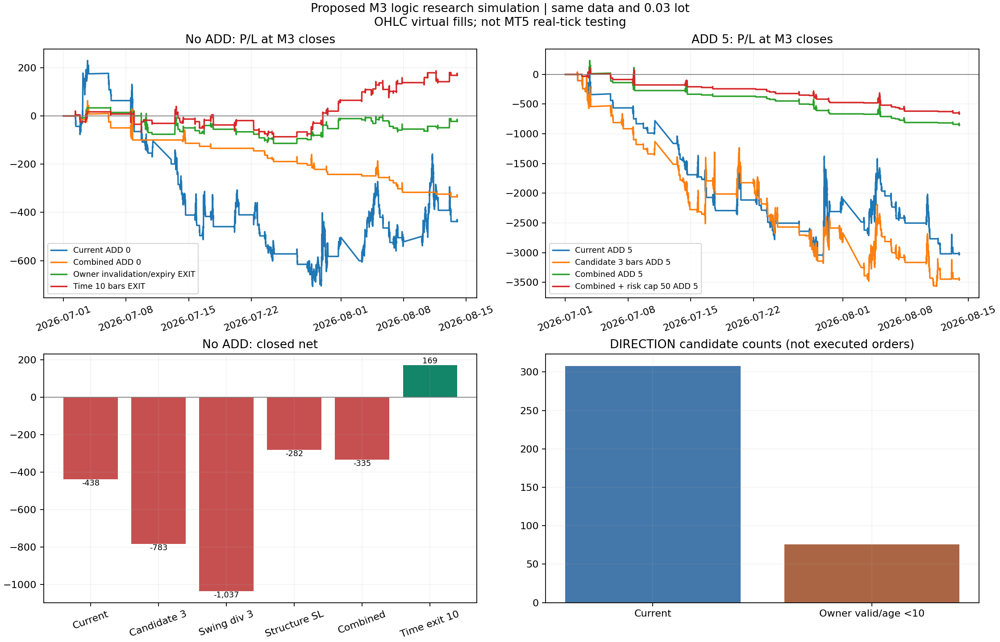

# 사전신호 수정안 가상 시뮬레이션

**결론: 앞서 제안한 로직을 구체적인 가정으로 구현한 가상 모델에서도 개선된 수익성을 입증하지 못했다.** 상태 관리만으로 현행을 재현한 모델은 동일 결과였고, 확인 확대·확정 스윙 divergence·실행 거리/비용 제한·구조 손절·owner 만료를 조합한 모델은 여전히 손실이었다. 아래 연구 값은 실제 EA에 구현하거나 배포한 값이 아니다.

## 기준과 범위

원본 v8.282 CSV의 14,639개 M3 봉, 서버시간 2026-07-01~2026-08-13, GOLD, 0.03 lot, 기본 percentage SL 0.35%, ADD 0/2/5를 사용했다. 기존 실제 확정 순손익은 +8,028.97이다. v8.284 원시 CSV는 읽지 못했고 v8.289/v8.290 실제 전략테스터 결과는 없다. 모든 후보는 이미 검토한 같은 기간 자료에 대한 연구이며 독립 검증이 아니다.

총 **49개 시나리오**. 확정 순손익과 PF는 청산 포지션 기준이다. 미청산 평가를 섞지 않았다. 낙폭은 M3 종가 평가이며 tick equity 최대 낙폭이 아니다. 계좌통화 명칭·초기 잔액·레버리지 정보가 없어 금액 단위만 비교한다.

## 한 가지 조건씩 변경

| 모델 | 청산 수 | 확정 순손익 | PF | M3 종가 최대 낙폭 |
|---|---:|---:|---:|---:|
| 현행 ADD 0 | 51 | -437.59 | 0.7437 | 937.05 |
| 후보 확인 1봉 ADD 0 | 51 | -437.59 | 0.7437 | 937.05 |
| 후보 확인 최대 3봉 ADD 0 | 64 | -783.17 | 0.6250 | 1,150.78 |
| 확정 스윙 divergence·1봉 ADD 0 | 40 | -840.64 | 0.4325 | 882.70 |
| 확정 스윙 divergence·3봉 ADD 0 | 57 | -1,036.58 | 0.4779 | 1,065.96 |
| 실행 거리 최대 1 ATR ADD 0 | 30 | -495.38 | 0.5263 | 802.38 |
| 비용/ATR ≤0.20 ADD 0 | 49 | -350.28 | 0.7837 | 849.77 |
| 극점 기반 구조 SL ADD 0 | 62 | -282.06 | 0.5742 | 520.71 |
| owner 무효화/만료 시 청산 ADD 0 | 69 | -21.73 | 0.9532 | 149.56 |
| 진입부터 10봉 시간 청산 ADD 0 | 65 | +169.25 | 1.3776 | 131.25 |

확인 기회 확대나 ‘더 의미 있어 보이는’ divergence 정의가 수익 개선으로 이어지지 않았다. 구조 손절은 ADD 0의 손실·낙폭을 줄였으나 PF가 1 미만이다. 신호 시점과 실행 시점의 구분은 바람직한 동작 관리이지만 그 자체가 새로운 수익 원천은 아니다.

## 추가진입·조합 결과

| 모델 | 청산 수 | 확정 순손익 | PF | M3 종가 최대 낙폭 |
|---|---:|---:|---:|---:|
| 현행 ADD 5 | 228 | -3,016.24 | 0.5059 | 3,117.67 |
| owner 무효화+10봉 만료 ADD 5 | 141 | -2,311.96 | 0.4638 | 3,031.85 |
| 확인 창 3봉 ADD 5 | 295 | -3,442.54 | 0.5451 | 3,608.56 |
| 구조 SL ADD 5 | 165 | -1,144.79 | 0.6217 | 2,663.27 |
| owner 무효화/만료 시 청산 ADD 5 | 140 | -134.24 | 0.8566 | 262.04 |
| 현행 신호+조합 ADD 0 | 32 | -335.14 | 0.0000 | 399.58 |
| 현행 신호+조합 ADD 5 | 57 | -839.88 | 0.0000 | 1,094.97 |
| 3봉 후보+조합 ADD 5 | 76 | -887.25 | 0.1508 | 1,215.03 |
| 확정 스윙 divergence+조합 ADD 5 | 55 | -404.76 | 0.4128 | 695.04 |
| 현행 신호+조합+진입 위험50 ADD 5 | 51 | -648.66 | 0.0000 | 784.02 |

조합은 **owner 10봉 만료+극점 이탈 무효화, 최초 주문 거리 최대 1 ATR, spread/왕복 slip/진입 fee 합의 ATR 비율 최대 0.20, 극점 기반 구조 SL, 모든 기존 layer의 비용 차감 이익 확인 후 ADD**다. 최초 신호의 판정 조건은 별도 표시가 없으면 현행 그대로다. owner 만료는 ADD 권한 종료이며 보유 포지션 청산과는 다르다.

현행 신호+조합 ADD 0은 32개 확정 포지션 모두 순손실(PF 0)이다. 조합으로 수익도 잘라냈으므로 손실 금액이 줄었다는 이유만으로 개선판으로 채택하면 안 된다. 50 계좌통화 진입 위험 제한을 더해도 수익성이 해결되지 않았다.

## 이번에 모델로 만든 수정 가정

1. **후보 상태 관리:** 확정 봉이 이전 6봉의 신규 극점이면 생성. 새 극점이 생기면 기존 후보 교체, 극점 이탈/3봉 초과이면 무효화. 후보당 한 번 발행하되 현행과 같은 3봉 동일 방향 cooldown도 유지했다. 1봉 확인은 현행 74개와 정확히 같았다. 3봉 후보 모델은 100개이며 앞선 위치 분석의 독립 pivot 검색 101개와 달리 최신 후보 교체를 적용해 1개가 줄었다.
2. **확정 스윙 divergence:** 이전에 확인된 1-left/1-right LOW 또는 HIGH를 저장. 후보 생성 시 비교 기준을 동결하며 최근 미래 봉으로 바꾸지 않는다. 간격 3~40봉, LONG 가격 LL/RAW HL, SHORT 가격 HH/RAW LH. 후보는 여전히 이전 6봉 극점이어야 하며 다른 기존 모멘텀 조건은 유지한다. 이 3~40봉 값은 연구 가정이며 최적값이 아니다.
3. **실행 거리:** 실제 시가 Bid/Ask+불리한 slip 기준의 최초 진입 거리를 최대 1 ATR로 제한. 최소 0.15 ATR와 기존 타당성 검사를 유지했다. ADD까지 동일 1 ATR 거리 제한을 적용한 모델은 아니다.
4. **비용:** `(spread+2*slip+0.07)/ATR ≤0.20`이어야 최초/ADD 허용. 0.07은 계약 환산 계수100에 대응하는 lot당 fee7의 가격 단위다. 과거 초기 비용만 반영한 예상치이며 future swap을 미리 쓰지 않는다.
5. **구조 SL:** LONG pivot low−buffer, SHORT pivot high+buffer. buffer=`max(0.10*ATR, 현재 spread, 0.01)`이고 tick 0.01로 바깥 반올림. 기존 공통 floor를 상속하고 기존 position SL을 넓히지 않는다. 이 모델은 percentage SL을 구조 SL로 대체한다. 단순하게 더 짧은 손절이 항상 안전한 것은 아니다.
6. **owner:** PRE가 설정한 pivot를 기준으로 가격 이탈이나 owner 시작 후 10봉에 권한 종료. 단절 시 reset. DIRECTION 후보는 현행 308개에서 76개로 줄었다. 기본 owner 제한 모델은 만료 시 강제 청산하지 않는다.
7. **ADD 순이익 확인:** 각 기존 layer의 시가 청산 추정손익에서 fee와 현재까지 accrued swap을 반영해 0보다 큰 경우만 ADD. future exit 가격·스왑은 사용하지 않는다.
8. **진입 위험50:** 공통 SL을 새 주문 후 예상 수준으로 적용한 각 layer의 손절 순손실 양수 부분 합이 50 이하면 허용. fee·현재 swap 포함, 유리한 layer 이익으로 다른 layer 손실을 상쇄하지 않는 보수적 합이다. 50은 계좌잔액 기반 sizing이 아닌 연구용 절대 금액이다. 주문 시 한도이며 이후 swap/gap/실제 stop slip 손실 보장은 아니다.
9. **분리 청산 대조군:** (a) owner 극점 이탈/10봉 만료 때 다음 시가 청산, (b) 첫 진입부터 10봉 보유 시 다음 시가 청산. 두 타이머의 시작점과 무효화 조건이 다르다. 방향 권한 제한과 보유 청산 효과를 혼합해 주장하지 않는다.

‘강한 추세’ 장세 필터와 기존 WATCH/ACCEL 경로를 유지하면서 TURN을 결합하는 완전한 대안 EA는 이번 모델에 포함하지 않았다. 그 정의·실제 tick 주문 경로를 추가 검증해야 한다. 49개는 앞선 제안 전체의 모든 가능한 구현을 대표하지 않는다.

## 보유 시간과 비용 대조

진입부터 10봉(연속 장중 약30분) 청산 ADD 0은 **+169.25**, PF **1.3776**, 종가 낙폭 **131.25**다. 그러나 owner 무효화/만료 시 청산 ADD 0은 **-21.73**이다. ‘짧게 보유’라는 표현 아래 서로 다른 청산 규칙을 같은 전략처럼 취급하면 안 된다.

동일 10봉 시간 청산에 spread 2배+각 체결 불리한 slip0.15를 넣으면 ADD 0 **+28.67**, ADD 5 **-171.23**다. 현행 신호+조합 ADD 5의 비용 stress는 **-324.09**다. 비용/ATR 필터 때문에 stress에서 거래 수가 줄어들 수 있으므로 손실 감소를 비용 증가가 유리하다는 뜻으로 해석하지 않는다. 현행 조합 ADD 0의 최초 진입은 33개, stress는 12개다.

## 체결 모델·검증·한계

- 모든 신호는 확정 봉까지의 입력만 사용하고 다음 존재하는 봉 시가에 거래한다. canonical spread는 확인 봉 행에 기록된 다음 봉 첫 tick 관측값을 쓴다. 미래 종료 spread를 진입에 사용하지 않는다.
- 기존 비용 보정: 1,129개 실제 진입 quote 오차0, 1,128개 실제 청산 PnL 오차0. 계약 환산100, 진입 fee7/lot·청산0, LONG swap−69.25/lot·SHORT+17.10/lot·수요일 triple. 이는 기존 체결의 비용 대조이며 가상 주문 전체가 broker tick과 같다는 보증은 아니다.
- 현행 ADD 0/5의 순손익·청산 수·최종 평가·PF·종가 낙폭이 이전 시뮬레이션과 정확히 일치했다. 후보 1봉 PRE도 실제 core74개와 일치했다. 시간 청산 비용 stress 대조군도 이전 결과와 정확히 일치했다.
- 모든 49개 모델에서 청산 손익 합계·잔여 포지션·최종 평가·주문 시간·ADD 수·lot 한도 검사를 통과했다. 4개 signal/owner 모델×3개 cutoff의12개 prefix 재생에서6개 출력 배열이 과거 시점까지 완전히 일치했다. LONG/SHORT 위험 한도 거절 시 cash/positions가 변하지 않았고 모든 포지션의 보호 SL이 넓어지지 않는 검사도 통과했다.
- SHORT SL은 Bid high+봉 시작 spread, LONG은 Bid low로 검사한다. 실제 intrabar Ask/spread·250ms stop 갱신·broker callback·청산 실패·마진 부족·tick 시간 순서는 완전 재현하지 못한다. 반대 PRE의 청산/반전은 같은 시가 부근 성공을 가정했다.
- 기간 마지막 진행봉은 제외하며 미청산 손익은 `end_equity_net`에 별도로 남긴다. `max_open_stop_risk`라는 기존 모델 필드는 entry–SL 절대 거리 합이므로 이익 보호 SL까지 포함한다. 실제 계좌 최악 순손실이나 새 risk50 합계와 같은 지표가 아니다.
- MT5 컴파일·실제 tick 백테스트가 아니고 모든 연구 값은 같은 자료를 사용했으므로 out-of-sample 성과가 아니다. 연구용 소스가 EA를 자동 변경하지 않는다.

## 판단

현재 수정안을 하나의 개선판으로 배포할 근거가 없다. 후보와 signal/주문 시각 로그를 분리하는 상태 관리부터 도입하되, 기존 진입·청산 경로는 보존한 비교 버전을 유지하는 것이 타당하다. 수익성이 나온 소수의 시간 청산 모델도 금액이 작고 비용에 취약하다. 독립 기간에서 MAX ADD0과 동일 lot로 검증한 뒤에만 구조 SL·장세 분류·ADD를 단계적으로 검토해야 한다.

## 제공 파일과 재현

`comparison.csv`, `results.json`, `runs/<모델>/orders.csv,closed_positions.csv,cycles.csv,equity.csv,metrics.json`, `signals_*.csv`, `candidate_events_*.csv`, `calibration.json`, `validation.json`을 제공한다. `run_research.py`=신호/연구 모델, `broker_model.py`=가상 broker, `validate.py`=검증, `make_report.py`=보고서/차트다. Python pandas/numpy/matplotlib을 설치하고 `python run_research.py`, `python validate.py`, `python make_report.py` 순으로 재현한다. 기준 CSV는 분석용 축약본이다.
