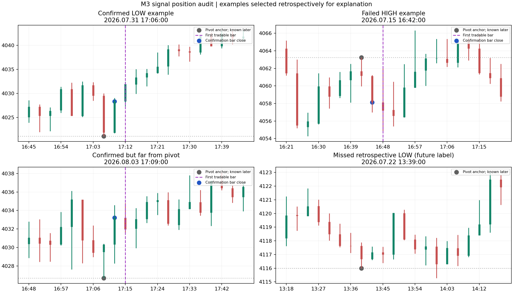

# M3 저점·고점 사전신호 위치 수정 검토

결론: 현재 사전신호는 극점 자체의 실시간 예측이 아니라 **직전 봉의 극점을 다음 봉에서 확인하는 신호**다. 정확도 개선은 화살표를 과거로 옮기거나 조건을 완화하는 것으로 해결되지 않는다. 극점 후보·확정 신호·주문 허가를 분리하고, 동일 극점의 수명과 무효화, 실제 체결 가격의 극점 거리를 관리하는 수정이 우선이다. 아래 제안은 구현 설계이며 수익 개선이 입증된 새 EA가 아니다. EA는 이번 분석에서 변경하지 않았다.

## 자료와 분석 범위

v8.282 원본 CSV에서 추출한 14,639개 M3 봉과 현재 v8.290 실제 코어가 계산한 PRE 74개를 사용했다. 기준 기간은 2026-07-01~2026-08-13이고 첫 행은 직전 거래일의 마지막 봉이다. 날짜·시간은 CSV 서버시간 그대로이며 KST 변환 근거는 없다. v8.284 원시 CSV는 전송 한도로 읽지 못했다. v8.289/v8.290 실제 전략테스터 결과는 없다.

소스 검토 대상은 원본 v8.282, 경량 v8.289, 새 주문 경로 v8.290 및 제공된 Joon_MACD_v2_05_OPT_VALIDATION.mq5, Joon_delta_volume_v1_01_OPT_VALIDATION.mq5다. v8.284~v8.286의 Turn 계열이 v8.290에 이식되어 사용되는 경로도 확인했다. 결과 파일/옛 변경 기록은 분석 자료로만 다루었다.

## 각 프로그램의 현재 역할과 문제

| 소스 | 확인한 계산 | 위치 정확도에 미치는 영향 | 수정 방향 |
|---|---|---|---|
| v8.282/v8.289 StateEvaluationEngine.mqh | MACD 전환과 가격 진행, Wave 부호에 따른 WATCH 방향 우선권; delta는 참여 진단 | 추세 전환·확인 신호다. 모든 국지적 저점·고점을 포착하는 알고리즘은 아니다. Wave 0선 확인은 반전 초기보다 늦을 수 있다 | 기존 추세 거래 경로를 보존하며 별도 TURN 후보를 계산. WATCH와 국지적 TURN의 목적을 구분 |
| v8.290 TurnCore.mqh | 직전 봉이 그 이전 6봉 극점, 다음 봉이 극점 미갱신·종가 반등/하락, 거리 0.15~1.25 ATR; RAW/Wave/Delta 모두 동의; divergence 필수 | 모든 확인이 한 봉에서 모여야 한다. 신호 발생 때 이미 평균 약 1 ATR 이동. 비교 대상 raw divergence는 이전 6봉 가격 극점이지 이전 확정 스윙은 아니다 | 후보 ID·발생 시점·무효화 도입. 확인된 같은 종류 스윙 간 divergence와 단기 exhaustion을 구분 |
| TurnSignalEngine.mqh | 화살표는 확인 봉에 그린다. 별도 회색 점은 과거 pivot 봉에 표시 | 회색 점의 과거 위치를 당시 거래 가능 신호로 오인할 수 있다 | pivot_time, confirmation_time, available_time을 모두 출력. 주문은 available_time 이후만 허용 |
| TurnDirectionCore.mqh | PRE가 owner를 설정하고 이후 가격/MACD-base 진행 시 OFF→ON 이벤트 | PRE owner의 기간 만료·pivot 가격 훼손 검사가 없다. 반대 PRE나 자료 단절 전까지 오래된 방향이 살아남을 수 있다 | pivot 무효화와 owner 만료 추가. 만료 기간은 별도 검증; 예시 5~10봉을 검증 후보로만 사용 |
| TurnOrderEngine.mqh / RiskEngine.mqh | PRE 최초·반대 청산/반전, 같은 방향 PRE/DIRECTION ADD; percentage SL·공통 보호 floor | 위치 신호가 장시간 보유·추가진입 권한으로 확장된다. 기존 가상 분석 ADD 5 순손익 -3,016.24 | signal_valid와 order_eligible을 분리. 극점 이탈·비용·보호 가능 손절을 주문 시 다시 검사 |
| Joon_MACD_v2_05 | raw=가격 EMA12−EMA26; Wave=평활 raw+추세/압력 bias | raw와 Wave는 독립 센서가 아니다. CSV의 변화량 상관 0.8722 | RAW/Wave를 한 모멘텀 그룹으로 관리. 변경 효과는 별도 검증 |
| Joon_delta_volume_v1_01 | rawDelta=선택 거래량×봉 압력; EMA14(rawDelta) | 실제 aggressive buy−sell 체결 델타가 아니다. EMA 변화에는 거래량 변화도 섞인다 | candle-pressure proxy로 명시. volume-normalized pressure의 EMA를 별도 비교; 실거래 델타로 해석 금지 |

델타의 기본 압력은 `0.70*(2*C-H-L)/(H-L)+0.30*(C-O)/(H-L)`이다. CSV의 `rawDelta/volume`와 이 수식의 최대 절대 차이는 **1.60e-11**이었다. 즉 이 항목은 봉 가격 정보의 재표현이며 독립적인 호가/체결 증거가 아니다. 거래량은 별도로 참여 강도를 나타낼 수 있다.

## 현재 신호의 위치 품질

- 74개 중 연속된 미래 5봉이 있는 72개에서 5봉 뒤 방향 일치율 **58.33%**. 이것은 거래 승률이 아니다.
- 확인 뒤 5봉 동안 원래 극점을 깨지 않은 비율 **59.72%**. 나머지 약 40%는 다시 극점을 갱신했다.
- 확인 봉 종가와 극점의 평균 거리는 **0.967 ATR**, 확인은 극점 봉으로부터 1봉 뒤다. 시간 예: pivot 봉 10:00 → 확인 봉 10:03 → 실제 신호 이용 가능 10:06. 극점 봉 시작으로부터 6분 뒤이고, 극점이 봉 안에서 언제 찍혔는지는 알 수 없다.
- 거리 1.0~1.25 ATR의 신호는 35개로 전체의 47.3%. 이 구간의 5봉 고정 청산 기회 평균 순가격 변화는 +0.125, 0.75~1.0 ATR의 27개는 +1.159였다. 표본이 작고 사후 구간 비교이므로 1.0 ATR 제한을 확정 최적값으로 쓰면 안 된다. 0.75 ATR 이하 12개는 극점 유지율이 40%여서 더 가까울수록 더 안전하다고도 할 수 없다.
- 7월 LONG 방향 일치율 60.71%에서 8월 LONG 50.00%로 내려갔다. 같은 기간 내부 월별 비교이며 독립 검증은 아니다.

사후 평가용 기준은 왼쪽 6봉보다 엄격한 신규 극점이며 오른쪽 5봉에서 유지되고, 그 5봉에서 극점부터 1 ATR 이상 움직인 지점이다. 이 정의로 1,532개 극점이 있으며 현행 PRE의 pivot ID가 정확히 맞은 것은 45개(2.94%)다. 이는 **이 특정 기준의 포착률**이지 모든 차트 극점의 보편적 정확도가 아니다. 오른쪽 미래 5봉은 평가 라벨에만 썼으며 실시간 입력으로 사용하지 않았다. 극점 봉 이후 5봉 기준과 확인 봉 이후 5봉 유지율의 평가 구간도 서로 다르다.



차트 사례는 설명을 위해 사후 선택했다. 파란 점=확인 봉 종가, 보라 선=첫 거래 가능 봉, 회색 점=극점 기준. 성과 대표 표본으로 해석하지 않는다.

## 조건을 바꾸면 실제로 개선되는가

기존 조건을 기준으로 8개 변형을 다시 계산했다. 아래 수치는 신호 품질이며 EA 거래 수익이 아니다.

| 조건 | 신호 수 | 5봉 방향 일치 | 극점 유지 5봉 | 5봉 고정 청산 평균 순가격 변화 |
|---|---:|---:|---:|---:|
| 현행 전체 조건 | 74 | 58.33% | 59.72% | +0.628 |
| divergence 제거 | 192 | 51.32% | 53.44% | -0.060 |
| delta 필수, RAW/Wave 중 하나 | 108 | 54.72% | 55.66% | +0.254 |
| RAW+delta, Wave 필수 제거 | 76 | 58.11% | 59.46% | +0.540 |
| 현행+종가 위치 65% 확인 | 64 | 55.56% | 58.73% | +0.431 |
| 동일 극점 확인 기회 1~3봉 | 101 | 55.10% | 56.12% | -0.074 |
| 1~3봉+RAW/delta/종가 위치, divergence 제거 | 292 | 49.13% | 54.33% | -0.443 |
| RAW 가속도 허용+종가 위치 | 99 | 51.55% | 54.64% | +0.038 |

5봉 순가격 변화는 다음 봉 시가 진입·5봉 뒤 종가 청산, Bid/Ask spread와 진입 수수료를 반영한 **각 신호의 독립 거래 기회 지표**다. percentage SL, 포지션 중첩·자동 주문·스왑·슬리피지는 이 표에 적용하지 않았다. 거래량 곱한 합계 수익으로 해석하거나 이전 EA 가상 결과와 직접 합산하면 안 된다. 같은 봉에서 target/stop을 먼저 찍었는지를 판정한 수치도 아니다.

**결론적으로 divergence 제거·모멘텀 완화·확인 지연 확대·단순 봉 모양 필터·가속도 허용은 이번 자료에서 현행보다 나아지지 않았다.** Wave를 제거해도 거의 비슷하지만 정확도 향상이 아니므로 기본 로직의 즉시 변경 근거로 부족하다. 3봉 후보 창은 상태 관리 용도로 제안할 수 있어도 그대로 신호를 더 발행하는 개선안으로 채택하지 않는다.

## 권고하는 수정 로직: 후보 → 확인 → 주문 허가

### 1. 후보는 극점이 생긴 확정 봉에서 기록

봉 `p`가 확정될 때 과거 6~12봉의 신규 저점/고점인지 검사하고 후보를 저장한다. 미래 봉 없이 가능한 계산이다. `candidate_id, side, pivot_time, pivot_price, ATR_at_pivot, created_available_time`을 가진다. 6봉은 현행 기준이고 12봉은 검증할 장기 구조 비교값이다.

저점 후보라면 아래꼬리·종가 회복, 가격 하락 대비 RAW 하락 둔화, normalized pressure 개선을 보조 설명으로 저장한다. 고점은 반대로 저장한다. 아직 확정 신호도 주문 허가도 아니다. 조건별 점수를 모두 CSV에 남기며 독립 정보처럼 중복 합산하지 않는다.

새로운 더 낮은 저점/더 높은 고점이 나오면 이전 후보를 무효화하고 새 ID를 생성한다. 이미 발행된 신호·주문 로그를 삭제하거나 이동하지 않는다. 원래 가격과 취소 사유를 보존한다.

### 2. 확인은 상태 전이로 발행

다음 확정 봉에서 극점 유지, 방향성 종가 회복, RAW 모멘텀 전환, pressure 전환을 검사한다. 기존 strict 조건은 비교 기준으로 유지한다. 다른 후보 창이나 점수 조합은 검증 모드에서만 계산한다. 동일 후보는 한 번만 신호를 발행하고 3봉 cooldown 대신 후보 ID 중복 방지를 핵심으로 둔다. 후보 수명 종료 시 취소하며 수명 3봉은 초기 연구 가정이다.

`pivot_time`에 붙이는 회색 참고점과 `confirmed_bar_time`의 신호, `available_time` 이후의 실행 이벤트를 서로 다른 객체/필드로 표시한다. 늦게 확인한 점을 과거의 매매 신호로 소급하지 않는다.

### 3. divergence를 같은 종류 확정 스윙끼리 계산

현재 최근 6봉 최저/최고를 이전 스윙처럼 사용하는 대신, 이미 확인되어 저장된 이전 LOW/HIGH의 가격·RAW를 참조한다. 저점은 가격 LL + RAW HL, 고점은 가격 HH + RAW LH를 검사한다. 비교 스윙의 최소 간격과 최대 나이는 별도 파라미터로 둔다. 이 새 divergence는 아직 수치 검증하지 않았으므로 현행 즉시 대체가 아니라 나란히 기록할 후보 모델이다.

### 4. 주문 직전에 위치·비용·무효화를 다시 검사

LONG은 실제 Ask, SHORT는 실제 Bid를 사용해서 pivot 거리/ATR를 재계산한다. 확인 종가 기준의 거리만으로 주문을 허가하지 않는다. gap·스프레드로 거리 초과, pivot 무효화, quote freshness 실패, 구조 손절을 놓을 수 없는 경우 주문을 보류하고 이유를 기록한다.

구조 손절 후보는 LONG=`pivot_low-buffer`, SHORT=`pivot_high+buffer`로 잡되 broker 최소 거리·tick size·spread·기존 protected floor와 함께 검증한다. buffer·최대 허용 거리·비용/ATR 비율은 별도 기간 검증 후 정해야 한다. 1.0 ATR 거리 제한은 위 구간 분석에서 나온 연구 후보이며 확정값이 아니다. 포지션이 있는 상태에서 손절을 넓히는 변경은 허용하지 않는다.

### 5. 강한 추세의 반대 신호와 추세 재개를 구분

기존 프로그램의 확인된 HL/HH 또는 LH/LL, established_side, 기존 MACD-base 추세·MA22 거리 정보를 사용한다. 강한 하락 중 작은 LONG 반등은 `COUNTERTREND_CANDIDATE`, 가격 구조 회복 뒤에만 `CONFIRMED_REVERSAL`로 승격하는 별도 경로를 비교한다. 가격이 EMA 아래라는 이유 하나만으로 모든 저점 후보를 제거하지 않는다. 정확한 승격 조건은 아직 검증 전이다.

기존 WATCH/ACCEL 추세 수익·보호 청산은 보존한 비교 버전을 두어야 한다. 새 PRE로 기존 최초 진입과 모든 청산을 동시에 대체하면 위치 개선의 효과를 분리할 수 없다.

### 6. DIRECTION owner·추가진입의 수명을 제한

owner에 `pivot_price, invalidated, expires_at, last_structural_progress_time`을 추가한다. pivot 이탈, 자료 단절, 만료, 반대 확정 PRE이면 owner 종료. 새 PRE 없이 오래된 owner만으로 DIRECTION ADD가 살아나지 않게 한다.

추가진입은 유효한 owner와 새 HL/LH 재확인, 실제 net 비용을 뺀 보유 수익, 공통 보호 손절의 최악 손실 제한을 충족할 때만 후보가 된다. 이전 모든 layer가 수익인 조건 하나만으로도 가상 손실이었으므로 이 조합의 수익성은 별도 평가해야 한다. 초기 검증은 MAX ADD 0으로 실시한다.

### 상태 전이 의사코드

```text
on M3 closed bar:
    update causal ATR, raw MACD, normalized pressure, confirmed structure
    invalidate candidates whose extreme was broken; keep immutable audit records
    create/update candidate on new historical extreme
    evaluate confirmation of live candidate using closed bars only
    emit once per candidate_id; record pivot_time/confirmed_time/available_time
    expire direction owner on invalidation/time limit/discontinuity
on eligible next quote:
    recompute executable pivot distance, spread cost, structural stop risk
    if signal_valid and order_eligible: allow initial entry
    only if owner valid and separate ADD guards pass: allow additional entry
```

## CSV에서 반드시 구분할 항목

`candidate_id, candidate_state, pivot_time, pivot_price, confirmed_bar_time, available_time, raw_step, raw_accel, wave_step, pressure_norm, pressure_ema_step, divergence_reference_id, regime, distance_at_confirmation_atr, distance_at_execution_atr, spread_atr, invalidation_time, invalidation_reason, owner_age_bars, signal_valid, order_eligible, order_block_reason`.

과거 신호 객체는 삭제·소급 이동하지 않는다. candidate 변경 기록을 따로 남긴다. 차트 표시 이벤트·주문 이벤트·CSV 이벤트에 동일 candidate_id를 사용한다. CSV는 모든 실시간 결정의 거절 사유를 기록해야 표시가 있는데 주문이 없는 경우도 분석할 수 있다.

## 검증과 채택 기준

현재 strict 신호를 Python으로 독립 재구성한 `(확인 봉, pivot 봉, 방향)` 목록은 실제 코어 74개와 **완전 일치**했다. 8개 계산 경로를 데이터 1,000/5,000/10,000봉에서 잘라 반복한 24개 prefix 불변 검사도 통과했다. 새 비교 조건들은 확정 봉까지의 입력만 쓴다. 미래 3/5/10봉 데이터는 성과 평가용이며 실시간 분기에 들어가지 않는다.

1. 위치 평가: 극점 유지율, 포착률, 확인 지연, 실행 거리, 방향별·월별 실패율을 각각 평가.
2. 거래 평가: 동일 주문/청산/lot/SL의 조건에서 신호만 바꾸어 MT5 실제 tick 비교. 이후 청산 변경과 ADD 변경은 각각 따로 비교.
3. 시간 평가: 역방향 전체 자료 재생과 앞으로 prefix 재생의 신호 ID/시각 일치, shift 0 금지, 과거 객체 불변, gap 이후 warmup 확인.
4. 독립 평가: 아직 사용하지 않은 다른 날짜·추세/횡보 장세를 사용. 이번 7월/8월은 이미 사용했던 자료라 진짜 out-of-sample이 아니다.

위 제안 중 후보 상태 관리·실행 거리·감사 로그·owner 무효화는 원인 추적과 안전한 동작의 수정이다. 새로운 divergence/장세 조건/구조 손절은 연구 후보이며 수익 개선을 보장하지 않는다. 현재 자료는 오히려 쉽게 조건을 풀면 정확도가 내려간다는 증거다.

## 파일과 재현

`study.py`와 제공된 `market_bars.csv`, `signals.csv`로 8개 변형 분석을 재현한다. `python study.py`, `python plot.py` 순서다. Python pandas/numpy/matplotlib이 필요하다. 데이터는 원본 CSV의 분석용 축약본이다.

`signal_locations.csv`: 개별 신호 위치·평가. `variant_summary.csv`, `variant_by_month_side.csv`: 전체/분리 성과. `extrema_coverage.csv`, `retrospective_extrema_labels.csv`: 사후 평가 기준과 포착률. `distance_buckets.csv`, `indicator_dependency.json`: 거리·중복 지표 분석. `source_snapshot/`: 검토한 소스. `chart_examples.csv`: 사후 선택된 설명 사례.
