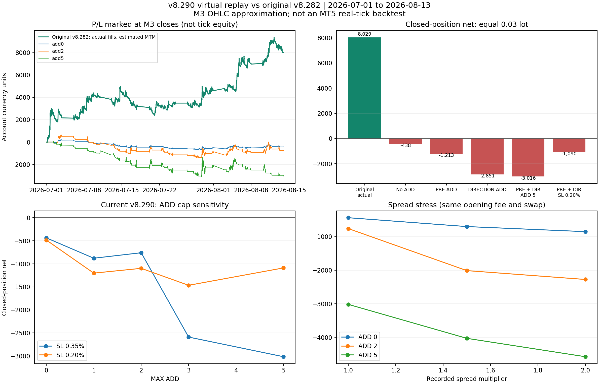

# v8.290 가상 시뮬레이션·기존 결과 비교

**결론: 현재 v8.290 주문 로직은 이 자료의 가상 거래에서 기존 결과보다 나빴습니다. 추가진입을 늘려 수익을 개선한다는 근거가 나오지 않았습니다.** 동일 lot·손절에서 ADD 없음도 손실이고, PRE/DIRECTION ADD 5에서는 손실과 낙폭이 더 커집니다. 현행 전략을 무조건 개선판으로 취급하면 안 됩니다.

## 비교 기준

기준은 현재 읽을 수 있는 원본 **v8.282 CSV**(59,553행, 14,639개 확정 M3 봉, GOLD, 2026-07-01~2026-08-13)입니다. 최근 첨부 v8.284 원시 CSV는 32 MiB 전송 한도 때문에 읽지 못했고, v8.289/v8.290 실제 전략테스터 결과도 아직 없습니다. 따라서 ‘v8.289 실제 대비’ 또는 ‘v8.290 실제 백테스트’라고 주장하지 않습니다.

원본과 맞춘 주 비교 설정은 **0.03 lot · SL 0.35% · MAX ADD 최대 5**입니다. 원본 소스/입력 기본값만 추정한 것이 아니라 실제 진입 로그에서 확인했습니다. 원본은 최초 진입 350개·ADD 779개, 확정 청산 1,128포지션·349cycle이며 확정 순손익 +8,028.97입니다. 계좌통화 명칭과 시작자산·레버리지는 CSV에 없어 금액을 계좌통화 단위로 표시하고 수익률%·자산% DD·마진 부족은 계산하지 않습니다.

## 동일 조건 비교

PF와 승률의 단위는 모두 **확정 청산 포지션**입니다. 실현 DD는 포지션의 최종 순손익을 청산 순서로 누적한 값이며 tick equity DD가 아닙니다.

| 실행 방식 | 확정 청산 포지션 | 확정 순손익 | PF | 실현 최대 DD |
|---|---:|---:|---:|---:|
| 기존 v8.282 실제 | 1,128 | +8,028.97 | 1.5307 | 2,088.77 |
| v8.290 ADD 없음 가상 | 51 | -437.59 | 0.7437 | 851.97 |
| 사전신호 ADD만, 최대 5 가상 | 71 | -1,213.08 | 0.4902 | 1,364.63 |
| 방향신호 ADD만, 최대 5 가상 | 223 | -2,850.54 | 0.5200 | 2,919.87 |
| 두 신호 ADD, 최대 2 가상 | 141 | -760.19 | 0.8213 | 1,858.40 |
| 두 신호 ADD, 최대 5 가상 | 228 | -3,016.24 | 0.5059 | 3,041.14 |

새 두 신호 ADD 5의 최초 진입은 58개, ADD는 PRE 8개 + DIRECTION 166개입니다. 총 232번 진입 중 228포지션이 기간 내 청산되고 4개가 남았습니다. 원본과 달리 최종 미청산 포지션을 강제 청산해 실현손익으로 섞지 않았습니다. 이 시뮬레이션의 마지막 시가평가 손익은 **-3,027.79**, ADD 없음은 **-436.12**입니다. 원본 마지막 position 2258은 청산 기록이 없어 잔존 SHORT로 가정한 시가평가 손익 +8,019.01은 **추정치**이며 확정 +8,028.97과 구분합니다. 마지막 비교 시점은 마지막 완결 M3 봉의 종료인 2026-08-13 23:57이고, 원본 파일의 끝 23:59:58까지 남은 진행봉은 없습니다.

M3 종가로 추정한 equity DD는 원본 **2,596.58**, ADD 없음 **937.05**, 새 ADD 5 **3,117.67**입니다. 원본은 실제 체결 경로를 사용한 종가 평가이고 새 버전은 가상 체결 경로를 사용한 종가 평가입니다. broker tick 단위 최대 낙폭의 검증값이 아니며 별도의 실현 DD와 혼동하면 안 됩니다.

## 추가진입·손절 민감도

| MAX ADD | SL 0.35% 순손익 | SL 0.20% 순손익 |
|---:|---:|---:|
| 0 | -437.59 | -485.53 |
| 1 | -879.14 | -1,202.84 |
| 2 | -760.19 | -1,098.83 |
| 3 | -2,590.17 | -1,466.85 |
| 5 | -3,016.24 | -1,089.61 |

0.20%는 배포 소스의 기본 손절이며 lot을 원본과 같은 0.03으로 유지한 비교입니다. 0.20%·ADD 5는 -1,089.61로 0.35%보다 덜 손실이지만 여전히 기대 개선을 입증하지 못했습니다. 소스 기본값 전체(0.10 lot·SL 0.20%·ADD 0)로 실행하면 -1,618.39이지만 lot이 달라 원본 금액과 직접 공정 비교하는 주 결과로 쓰지 않습니다.

현행 로직의 비용/방향/손절 가정 변형 32개는 모두 확정 손익이 음수였습니다. 이는 테스트한 조건의 결과이지 모든 파라미터에서 손실이라는 수학적 증명은 아닙니다. ADD 5·SL 0.35%에서 스프레드만 1.5배로 높이면 -4,027.25, 2배이면 -4,574.08, 2배+각 주문 가격에 불리한 0.15 가격단위 슬리피지를 넣으면 -4,682.98입니다. gap과 보호 SL 변화로 주문 경로가 달라져 비용 변화가 항상 단조적일 필요는 없습니다.

## 손실이 난 구체적인 부분

1. **관찰 기간과 주문 보유 기간이 다릅니다.** 앞서 제시한 58.3%는 5봉 뒤 가격 방향의 일치율이며 거래 승률이 아닙니다. 현재 프로그램에는 5봉 청산이 없고 반대 PRE 또는 broker SL까지 보유합니다. ADD 없음의 평균 보유는 약 9.95시간, ADD 5는 7.23시간으로, 원본 실제 포지션 평균 약 2.75시간보다 길었습니다. 짧은 반등 확인을 장시간 보유 권한으로 쓰면 초기에 맞은 신호가 나중에 되돌아갈 수 있습니다.
2. **SHORT 손실이 집중됩니다.** ADD 5·SL 0.35%의 LONG 합계는 -73.36, SHORT 합계는 -2,942.88입니다. SHORT가 총 순손실의 약 97.6%를 차지합니다. 같은 자료에서 LONG만 허용한 가상 결과도 -73.36으로 충분한 개선은 아닙니다. 이 자료만 보고 SHORT를 영구 제거하는 판단은 과적합 위험이 있습니다.
3. **DIRECTION ADD의 가격/MACD 증가·감소만으로 충분하지 않습니다.** 확정 청산된 DIRECTION ADD 163건의 순손익은 -2,132.96입니다. 이 값은 ADD 자체의 손익이며, ADD가 공통 SL과 다른 포지션 수명도 바꾸므로 순수한 인과 효과 전부라고 해석하지 않습니다. ADD 없음/ADD 2/ADD 5의 반사실 비교도 모두 손실이며 ADD 5가 특히 악화됐습니다.
4. **대부분 손절로 끝납니다.** ADD 5의 228개 확정 포지션 중 SL 청산은 189개(일부는 공통 보호 SL로 이익 청산)이며 합계 -5,859.67입니다. 반대 PRE 청산 39개의 +2,843.43이 이를 상쇄하지 못했습니다. 포지션 승률은 21.49%, 완료 cycle 승률은 14.04%입니다. 새 cycle 최대 손실 -341.61은 원본 cycle 최대 손실 -206.43보다 큽니다.
5. **드문 큰 추세 수익을 그대로 보존하지 못했습니다.** 원본 상위 5cycle 합계 +6,256.74가 전체 순익의 약 77.9%였습니다. 원본은 빈번한 WATCH/ACCEL·기존 청산/보호 구조를 통해 이 구간을 잡았습니다. 새 PRE 74개를 최초 진입 권한으로 바꿔 기존 경로를 배제한 것은 표시 정확도 개선 이상의 큰 전략 변경입니다. 원본 수익이 새 로직으로 이전된다고 볼 수 없습니다.

## 별도 가상 대안 — 현재 EA에는 미구현

손실 원인을 구분하기 위해 아래 대안 7개를 **별도 연구 모델**로만 계산했습니다. 기존 EA 코드를 수정하거나 이 결과로 새 프로그램을 배포하지 않았습니다.

| 가정 변경 | 순손익 | PF | M3 종가 equity DD |
|---|---:|---:|---:|
| 이전 모든 layer가 수익일 때만 ADD, SL 0.35% | -2,481.95 | 0.5516 | 2,704.40 |
| 이전 모든 layer가 수익일 때만 ADD, SL 0.20% | -788.91 | 0.7294 | 1,804.11 |
| ADD 없음 + cycle 5봉 보유 제한 | +101.28 | 1.3209 | 118.32 |
| ADD 없음 + cycle 10봉 보유 제한 | +169.25 | 1.3776 | 131.25 |
| ADD 5 + cycle 5봉 보유 제한 | +68.28 | 1.1203 | 172.86 |
| 5봉 제한 + 스프레드 2배 + 슬리피지 0.15 | +2.61 | 1.0078 | 154.08 |
| 10봉 제한 + 스프레드 2배 + 슬리피지 0.15 | +28.67 | 1.0619 | 182.64 |

5봉은 약 15분, 10봉은 약 30분이며 휴장 gap이 있으면 실제 시간이 더 길어집니다. 단기 청산을 넣으면 작은 양수 결과로 바뀌어 보유 기간의 중요성을 보여줍니다. 그러나 높은 비용에서 순익이 +2.61/+28.67로 거의 사라졌고, 기존 +8,028.97보다 훨씬 작습니다. **수익성 해결 또는 최적 설정이라고 주장하지 않습니다.** 모든 후보와 과거 신호 선정이 같은 기간을 사용했으므로 독립 holdout·다른 장세 검증이 필요합니다.

## 체결·비용 모델과 검증 범위

- 신호는 배포 v8.290의 **실제 TurnCore/TurnDirectionCore 함수 본문**을 C++ 호환 실행으로 14,639봉 재계산했습니다. PRE 74개·DIRECTION 308개가 이전 검증과 일치합니다. 방향 후보 308개를 모두 주문한 것은 아닙니다.
- 확인 봉 i의 신호는 다음 존재하는 봉 i+1의 시가에서 사용합니다. OHLC는 Bid 차트로 취급하고 LONG 매수는 Bid+당시 spread, SHORT 매도는 Bid입니다. 당시 spread는 확인 봉의 canonical 행(다음 봉 첫 tick에서 작성)에 기록된 값입니다. 다음 봉의 종료 spread를 진입 시점에 미리 쓰지 않습니다. 원본 1,129개 진입이 이 가격으로 **모두 오차 0**으로 재현됐습니다.
- point/tick 0.01, 손익 환산 계수 100, 진입 수수료 lot당 7, 청산 수수료 0을 실제 로그로 대조했습니다. 0.03 lot의 진입 비용은 0.21입니다. LONG 스왑 lot당 -69.25, SHORT +17.10, 수요일 triple로 계좌통화 반올림을 적용한 모델이 확정 포지션 1,128개 각각의 최종 PnL을 **오차 0**으로 맞췄습니다. 이는 같은 브로커 설정을 추정한 것이며 다른 브로커에 그대로 적용할 수 없습니다.
- Buy SL은 Bid low, Sell SL은 Bid high+봉 시작 spread로 검사합니다. 봉 시작 gap이 stop을 넘으면 stop 가격이 아닌 불리한 시가에서 체결합니다. 봉 내부 spread는 시작값을 고정하므로 실제 Ask tick의 고가·손절 시점은 근사입니다. 기간 중 변동 스프레드·미세 gap·슬리피지는 비용 민감도로 확인했습니다.
- ADD마다 새 layer의 percentage SL을 기존 보호 floor와 합치고, 다음 tick의 RiskSelectedPositionExpectedSL/EnsureManagedStopsProtected 동작을 근사해 전체 layer의 SL을 더 보호되는 수준으로 올립니다. 독립 SL 가정도 별도로 계산했으나 손실이었습니다. 실제 250ms 보호 갱신·콜백 지연·동기화는 재현하지 못했습니다.
- 반대 PRE 청산은 모두 성공하고 broker 콜백이 도착한 뒤 같은 시가 부근에서 반대 진입할 수 있다고 가정합니다. 실제 EA는 다음 tick을 기다리므로 가격 차이·청산 실패로 결과가 달라집니다. 같은 봉의 ADD 중복, 첫 진입/직전 ADD와 같은 진행봉의 ADD, MAX ADD·total lot 제한은 재현했습니다.
- 주문 실패·마진 부족·수동 개입·swap 조건 변경·과거 시작 전 warmup 자료·원본 CSV 마지막 진행봉과 미확정 청산은 완전 재현할 수 없습니다. SL 봉 내부의 정확한 초 단위 체결 시각도 없어 보유 시간은 근사입니다. 시작자산과 레버리지가 없어 risk of ruin, margin stop-out, 수익률%는 산출하지 않습니다.
- 모델 검증 13종과 39개 시나리오의 포지션/cycle/손익/시가평가/횟수/시간 인과성 불변 검사를 통과했습니다. **이 검증은 MetaEditor 컴파일이나 실제 tick 기반 MT5 전략테스터를 대체하지 않습니다.**

## 판단과 다음 검증 순서

현재 v8.290의 ADD를 늘려 기존 수익을 개선할 것이라는 기대는 이 가상 분석에서 지지되지 않았습니다. 먼저 MAX ADD 0으로 새 PRE의 진입과 15~30분 보유 제한·방향별 성과를 별도 기간에서 검증하고, 그 뒤 실제 비용과 손절을 포함한 ADD 조건을 비교하는 순서가 타당합니다. 수익 상태 ADD 필터만 추가해서는 충분하지 않았습니다. 기존 전략의 큰 추세 수익·보호 청산을 보존하는 방식도 함께 비교해야 합니다.

EA 파일은 이번 분석에서 변경하지 않았습니다. 가상 결과가 음수라는 사실과 M3 근사라는 한계를 함께 보고 실제 MT5 결과로 확인해야 합니다.

## 제공 파일

- `scenario_comparison.csv`: 39개 설정과 결과.
- `runs/<설정>/closed_positions.csv`, `orders.csv`, `cycles.csv`, `equity.csv`, `metrics.json`: 가상 주문·청산·equity 원장.
- `baseline_deals.csv`, `baseline_bar_close_equity.csv`, `calibration.json`: 실제 비교 기준과 비용 대조.
- `market_bars.csv`, `signals.csv`, `source_snapshot/`: 축약 시장 자료, 실제 코어 계산 신호와 v8.290 소스 스냅샷.
- `simulate.py`, `replay_signals.py`, `test_simulation.py`: 재현 코드. Python pandas/numpy/matplotlib 및 C++17 g++가 필요합니다.
- 재현 순서: `python replay_signals.py`, `python simulate.py`, `python test_simulation.py`, `python make_report.py`.
